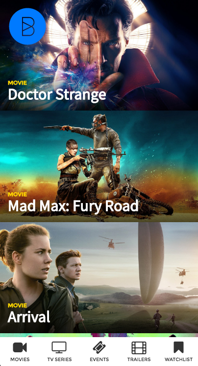
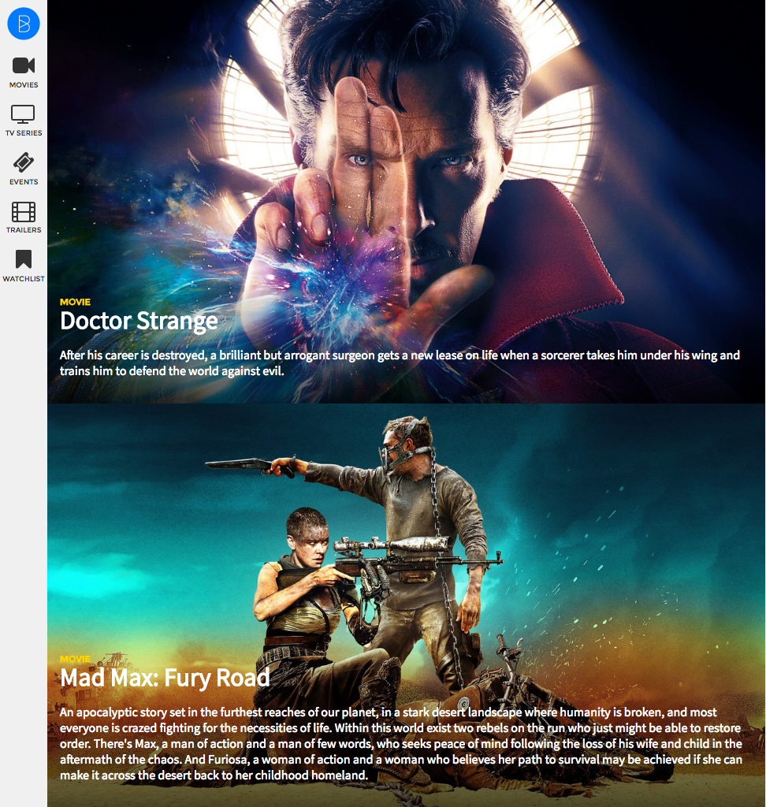
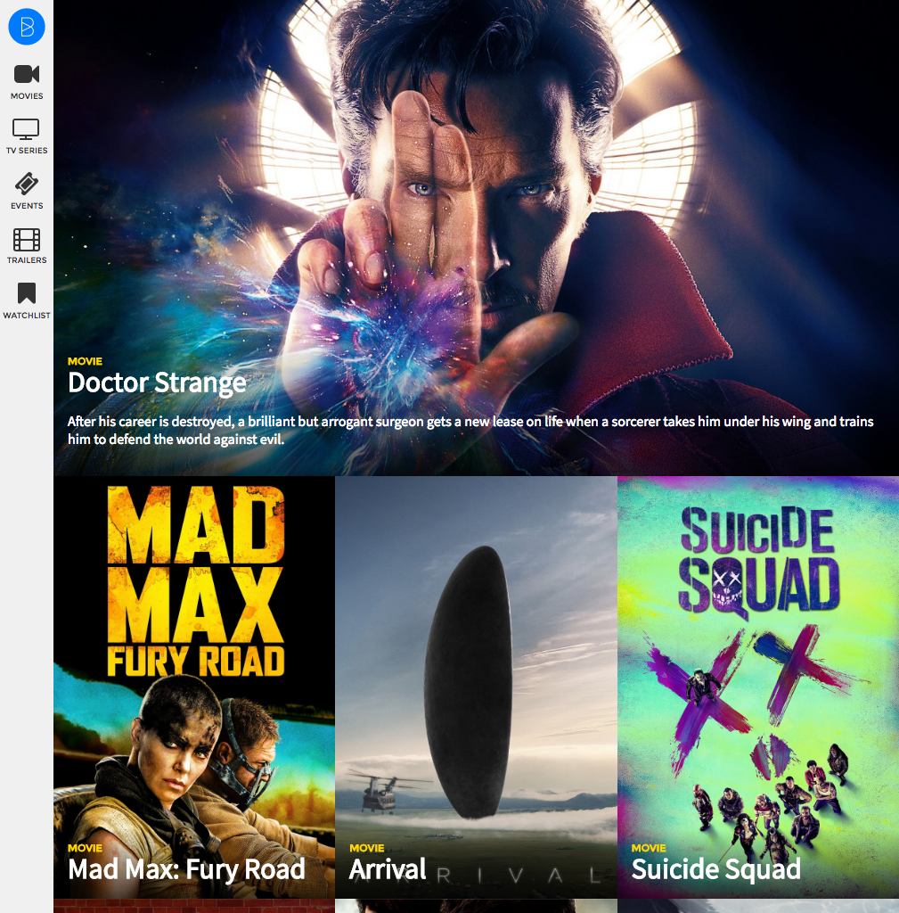

# Now Playing

This is a simple app that pulls the most popular movies currently playing in cinemas. It provides a simple mobile-first design for creating a responsive design based on this content.

## Setup

1. Fork and clone this repository
2. Run `rails db:setup`. This will create your database schema and seed it with popular films.
3. Run 'rails s' to start the server
4. Visit `http://localhost:3000` to see the starting layout.
5. Don't forget to commit your code frequently when making changes!

## Overview

Our movie app's single-column, mobile-first design has been implemented. It's up to us to turn this into a responsive design for devices of all sizes.

You'll get an opportunity to put together all of the techniques we've been practicing so far, including layout, positioning, Sass and media queries.

> This is a great assignment to work on in pairs or groups so you can help each other figure out how to implement the design changes.

### Step 1: Read the code

Since you'll be working with existing code, the first step should be to read through the provided code to get a handle on what it does.

Throughout the provided CSS you'll find comments explaining what particular rules are doing. By comparing the style rules in the stylesheets to the rendered output in your browser, you should get a better idea of what each rule does.

### Step 2: Use your developer tools

You'll need to get familiar with your browser developer tools to efficiently work through this design process. If you don't have your dev tools open, you're doing it wrong! Toggling style rules on and off in the developer tools is a great way to understand what effect they have on the selected elements.

For a refresher on how to use the Chrome Developer Tools for inspecting HTML and CSS, [check out Chapters 1 & 2 of this free Code School tutorial](http://discover-devtools.codeschool.com/)

### Mobile-first

This is the design you're starting out with:

The navigation bar is fixed to the bottom of the window and the logo is fixed to the top left corner. Film cards are stacked and the titles are overlaid over the image. There's a footer with navigation and a copyright notice, both are stacked at the bottom.

You'll notice the code is split out across several stylesheets and it makes use of Sass variables as well. Make sure you're comfortable with how it's all coming together before you set off on making the site responsive.

### Small screen design

Our first responsive breakpoint will occur at **768px**.

Once the device (or browser window) is wider than 768px,

* the navigation bar should move to be fixed to the left side of the window,
* the logo should be within the sidebar rather than floating on its own,
* the film overviews should be visible, and
* the footer sections should be side by side rather than stacked, with a black background and white text.

**Hint** Now that you're making a responsive design, you'll need to tell the browser. Don't forget your `<meta>` viewport tag!

### Large screen design

Our second responsive breakpoint will occur at **992px**.

Once the device (or browser window) is wider than 992px,

* Posters should show for all movies except the first one,
* Movie overviews should be hidden for all movies except the first one.
* Movies should be laid out in a 3-column grid, except for the first one.

**Hint!** You'll need to use the `:first-child` CSS pseudo-selector to make this happen. [You can read about how it works on MDN](https://developer.mozilla.org/en/docs/Web/CSS/:first-child).

### Review

This is a good time to review the skills you needed to finish this assignment:

* `display`,
* `float`,
* `position`,
* `@media`,
* the `<meta>` viewport tag
* variables in Sass
* nesting in Sass
* mixins in Sass

Make sure you ask to get help with any of the above concepts!

### And Beyond!

Once you've implemented the two previous breakpoints, it's up to you to make it your own. There are still some problems you can solve in here too!

For instance, you'll notice if you make the browser window wide enough that, at a certain width, the first film's image no longer fills the screen. That seems like a good candidate for another breakpoint!
